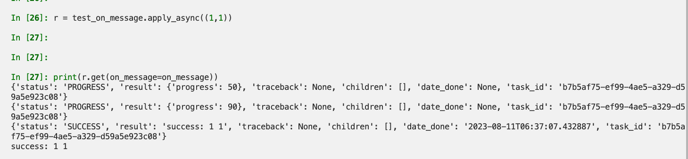
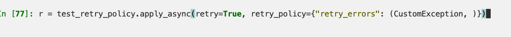

### linking
Both the callbacks(`link`) and errbacks(`link_error`) options can be expressed as a list.
The callbacks/errbacks will then be called in order, and all callbacks will be called with the return value of the parent task as a partial argument.

### on message
auto query

### eta and countdown
ETA lets you set a specific date and time that is the earliest time at which your task will be executed. 
`countdown` is a shortcut to set ETA by seconds.

### expiration
similar with eta and countdown, support the shorcuts and datetime object

### retry policy

### attention
- normal link trigger a new message but link_error will call the function directly.
-`countdown` is an integer, eta must be a `datetime` object.
- when worker receives an expired task it will mark the task as `revoked`
- if you specify a tuple of exception classes, you must make sure that you also specify the `max_retries` option, otherwise you will get error.

### warning
- tasks with eta and countdown are immediately fetched by the worker and unitl the scheduled time passes, they reside in the worker's memory.

### TODO
- retry_policy not take effect:

