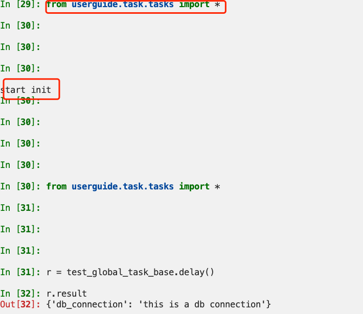

### task message ack
a task message is not removed from the queue until that message has been acknowledged by a worker. 
Since the worker cannot detect if your tasks are idempotent(幂等), the default behavior is to acknowledge the message in advance, just before it’s executed, so that a task invocation that already started is never executed again.


### task multi decorators
```python
@app.task
@decorator2
@decorator3
def tasksample():
    pass
```

### bound tasks
a task being bound means the first arguments to the task will alwasys be the task instance(self).
`app.Task.retry()` need bound tasks for accessing information about the current task request.
```python
@app.task(bind=True)
def add(self, x, y):
    print(f'requestid: {self.request.id}')
```

### logger
A special logger named 'celery.task', you can inherit from this logger to auto matically get the task name and unique id as part of the logs.

```python
from celery.utils.log import get_task_logger
logger = get_task_logger(__name__)
```

### retry
default retry will happen in 180s
you can override this setting by specify the `default_retry_delay` parameter to `@app.task()` or using `countdown` parameter in `self.retry`

default retry count is 3, see below:

A value of None about `max_retries` will disable the retry limit and the task will retry for ever until it succeeds.

### backends
- rpc backends: `rpc://`. it doesn't actually store the states, but rather sends them as messages.
- database result backed: polling the database for new states is expensive and some databases use a default transcation isolation level that isn't suiteable for polling tables for changes.

### states
- pending
- started: need enabled by config
- success:
- failure
- retry
- revoked
- custom states

### exceptions
- Ignore: force the worker to ignore the task. This means that no state will be recorder for the task, but the message is still acknowledged(removed from queue). This can be used if you want to implement custom revoke-like functionality, or manually store the result of a task.
- Regect: Rejecting a message has the same effect as acking it, but some brokers may implement additional functionality that can be used. This won't have any effect unless `Task.acks_late` is enabled. redelivered the rejected messages to another queue.
- Retry

### base task class
- Instantiation only once
- APP-wide usage: `app=Celery(task_cls='your.module.path:BaseClass')`

- handlers: before_start / after_return / on_failure / on_retry / on_success
- base requests: `on_timeout` and `on_failure` process in main process not prefork processes


### best practices
- ignore_result if you don't care the results of a task, as storing results wastes time and resources. ignore_result in apply > ignore_result in app.task > task_ignore_result setting
### parametes
- acks_late: acknowledge the message after the task returns
- bind
- base: base class of the task
- default_retry_delay: retry delay
- autoretry_for: retry for a particular exception
- retry_kwargs: retry parameters, eg: `{'max_retries': 5}`

- retry_backoff=True: use exponential backoff to avoid overwhelming the service
- rate_limit: this is a per worker instance rate limit, and not a global rate limit. To enforce a global rate limit, you must restrict to a given queue.

### settings
- task_reject_on_worker_lost: you really want to be redelivered the messages if the child process is be killed by system or calling sys.exit()

### attention
- i/o tasks need add timeout because a task indefinitely may eventually stop the worker instance from doing any other work.
- backends use resources to store and transmit results. To ensure that resources are released, you must eventually call `get()` or `gorget()` on EVERY AsyncResult instance returned after calling a task.
- A task is not instantiated for every request, but is registered in the task registry as a global instance. This means that the `__init__` constructor will only be called once per process, and that the task class is semantically(语义上) closer to an Actor.

